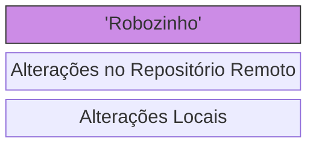
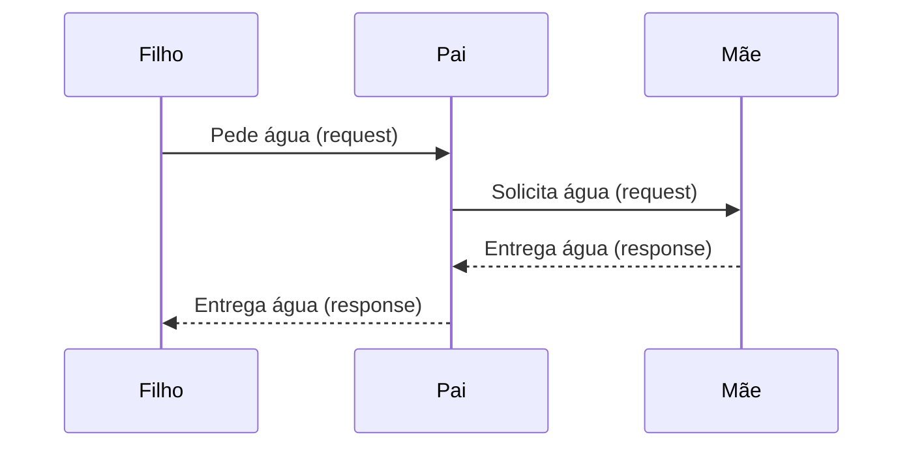

# Dia 7 - Como funciona a Internet

## Cliente e Servidor

### Fluxo do Continuous Deployment

> Continuous Deployment ou CD é o processo de sempre manter a versão online do seu projeto o mais atualizada possível em relação ao desenvolvimento local

Estrutura do Fluxo de Desenvolvimento padrão para CD:

Onde o Robozinho é o responsável por sempre fazer o 'Re-deploy' das aplicações e também pode ser configurado para fazer checagens de segurança antes de fazê-lo, para se certificar de que o código está seguro e funcionando como deveria antes de ser disponibilizado para a internet.

### Exemplo: Filho pedindo água

Esse exemplo representa, de forma simples, a estrutura cliente-servidor usando uma situação do dia a dia.

O filho quer água, mas não pode pegá-la sozinho. Então, ele faz um pedido ao pai. Nesse momento, o filho está atuando como **cliente**, pois está solicitando um recurso.

O pai recebe o pedido, mas também não tem a água. Assim, ele faz um novo pedido para a mãe. Aqui, o pai assume dois papéis:

* é **servidor** para o filho (pois recebeu a solicitação),

* e **cliente** da mãe (pois repassa a solicitação).

A mãe possui a água e atende ao pedido, entregando-a ao pai. Nesse ponto, a mãe atua como **servidor**, pois fornece o recurso solicitado.

Por fim, o pai recebe a água da mãe e a entrega ao filho, concluindo o processo. Assim, a resposta percorre o caminho inverso da solicitação.

Esse exemplo ajuda a entender que, em sistemas cliente-servidor, *uma mesma entidade pode atuar tanto como cliente quanto como servidor*, dependendo do momento e do papel que está desempenhando na comunicação.

O fluxo do pedido pode ser estudado melhor com o seguinte diagrama, que é útil para elucidar estes papéis na comunicação:

