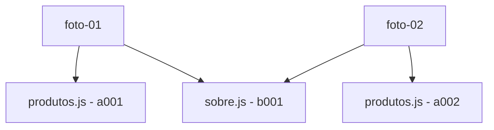
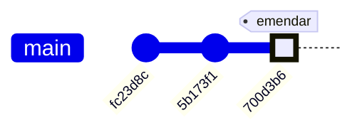
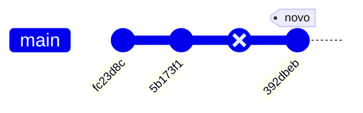
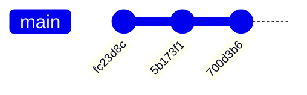
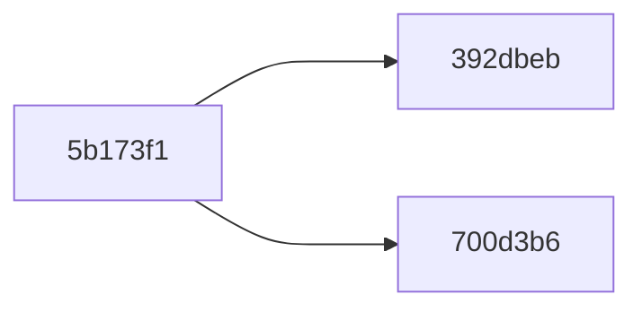
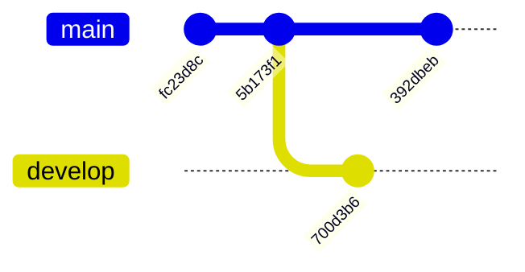
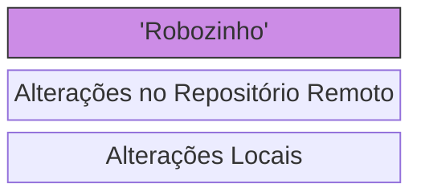
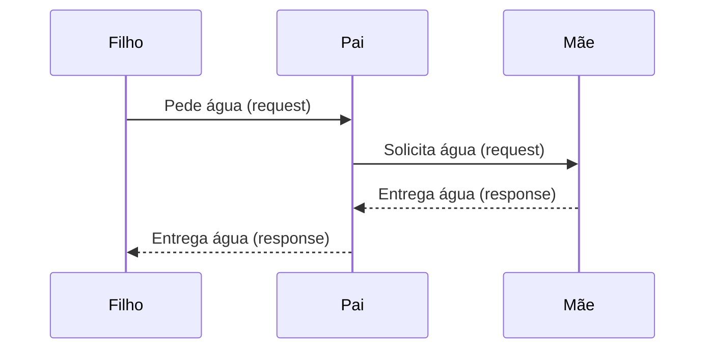

# Dia 1
Nesse dia, o Deschamps apenas apresenta o curso, suas expectativas e a lógica da "Fast Lane" e "Slow Lane".

# Dia 2 - Git e GitHub

## Diferenças entre Git e GitHub

Git é o software que controla as versões do código, ele é o responsável por controlar as alterações que são feitas no código.

GitHub é a plataforma que hospeda o código, ele é o responsável por hospedar o código e permitir que o código seja acessado por todos os membros da equipe.

### A Analogia

Confundir o Git e o GitHub é como confundir um vídeo que você tem dentro do seu computador e o YouTube. O vídeo é o código, o YouTube é o GitHub.

## Funcionalidades Interessantes do GitHub

O GitHub funciona como uma rede social, ou uma vitrine para você e seus códigos na internet. Nele, outras pessoas podem: comentar no seu código, *sugerir alterações*, entre outras coisas.

Quando muitas pessoas podem alterar a mesma base de código e contribuir com um projeto em específico, chamamos esse projeto de Open Source. Um exemplo de projetos Open Source é o [TabNews](https://tabnews.com.br), que vai ser o projeto que iremos criar um clone durante nossa jornada no [curso.dev](https://curso.dev).

## Ambiente de Desenvolvimento

Um ambiente de desenvolvimento, essencialmente é um lugar em que você pode: escrever e executar seu código.

# Dia 3 - Instalação dos Primeiros Pacotes

Para o projeto utilizaremos:
- `node.js lts/hydrogen` (Note que LTS significa Long Term Support, ou seja, suporte a longo prazo)
- `next@13.1.6`
- `react@18.2.0`
- `react-dom@18.2.0`

## Instalação Básica do node.js usando o nvm

Utilizaremos o `nvm` para realizar o versionamento do `node.js`.
Uma subversão do LTS terá retrocompatibilidade garantida com as outras subversões do LTS.

Para utilizar o `node.js lts/hydrogen` basta executar o comando:

```bash
nvm install lts/hydrogen
```
| Comando | Descrição    |
| ---------- | ---------- |
| `node -v` | Verifica a versão do node.js instalada |
| `npm -v` | Verifica a versão do npm instalada |
| `nvm -v` | Verifica a versão do nvm instalada |
| `nvm ls` | Lista as versões do node.js instaladas |
| `nvm use lts/hydrogen` | Utiliza a versão do node.js lts/hydrogen |
| `nvm alias default lts/hydrogen` | Define a versão do node.js lts/hydrogen como default |

## O arquivo .nvmrc

Caso mais de uma pessoa esteja trabalhando na mesma base de código, é inteligente que utilizemos uma ferramenta que garanta com que todas pessoas estejam usando a mesma versão de todas tecnologias ou, ao menos, versões compatíveis.

Curiosidade: O final `rc` significa `run command`, ou seja, comando de inicialização.

Para configurar o nvm para usar o `lts/hydrogen` basta garantir que dentro do seu arquivo `.nvmrc` tenha a versão do node.js que deseja utilizar, como segue:

```
lts/hydrogen

```

Note que o `enter` é um caractere especial que representa o final do arquivo, sendo necessário para o arquivo de configuração.

## Nextjs e a Analysis Paralysis

### Analysis Paralysis

A analysis paralysis é um problema que muitas vezes ocorre quando se está começando a aprender uma nova tecnologia. No mercado, é comum terem muitas opções para escolher e - ainda mais no momento em que estamos começando a aprender uma tecnologia nova - parece impossível escolher uma para começar. 

Tanto que, mesmo depois de escolher alguma ferramenta, é comum ainda ficarmos com a dúvida se fizemos ou não a escolha certa.

### Nextjs

O Nextjs é uma framework para React que permite criar aplicações web Full Stack com React. O Nextjs é uma ferramenta diferencial no mercado devido, principalmente, a sua flexibilidade, permitindo ao desenvolvedor a criar suas aplicações da forma que desejar, sem forçar uma forma específica de desenvolvimento.

### Iniciação do projeto node.js e instalação do Nextjs

Para iniciar um projeto node.js, basta executar o comando:

```bash
npm init
```

Ou, caso ainda queira pular todas as perguntas, basta executar o comando:

```bash
npm init -y
```

onde `-y` significa `yes`, ou seja, sim.

A única alteração que fizemos em todas as perguntas iniciais foi escolher a licença como sendo `MIT`, escolha que exploraremos um pouco mais adiante no curso.


### Instalando o Nextjs

Uma vez com o projeto inicializado, basta executar o comando:

```bash
npm install next@13.1.6
```

Ainda instalamos as outras dependências necessárias para o projeto, como segue:

```bash
npm install react@18.2.0 react-dom@18.2.0
```

Note que, para instalar mais de uma dependência, basta separar as dependências por espaço.

# Dia 4 - Protocolos da Internet

## O que é um serviço web

### Os diferentes protocolos da web

| Protocolo | Significado da Sigla |
| --- | --- |
| HTTP | Hyper Text Transfer Protocol |
| HTTPS | Hyper Text Transfer Protocol Secure |
| FTP | File Transfer Protocol |
| SMTP | Simple Mail Transfer Protocol |


### UDP vs TCP

Vídeo comparativo entre TCP e UDP: [HTML5 Games - UDP vs TCP](https://www.youtube.com/watch?v=ZEEBsq3eQmg)

Ambos protocolos têm como intuito comunicação de dados entre dois pontos da internet, mas com diferentes propósitos.

- *UDP*: Utilizado para comunicação de dados em que a ordem não é importante, como streaming de áudio e vídeo. Tende a ser mais veloz que o TCP, mas pode ter pacotes perdidos.
- *TCP*: Utilizado para comunicação de dados em que a ordem é importante, como transferência de arquivos e comunicação de dados. Tende a ser mais lento que o UDP, mas garante que todos os pacotes cheguem.

Note que, há outros protocolos mais robustos contruídos em cima do UDP e TCP, inclusive, o próprio HTTP é construído em cima do TCP, que - por sua vez - é construído em cima do IP (Internet Protocol).

O protocolo UDP também pode ser utilizado em aplicações em que não se pode haver a perda de pacotes, para isso, enviamos um mesmo pacote várias vezes, de modo que - mesmo se algumas cópias forem perdidas no caminho - ainda garantimos que o pacote chegue.

## Levantando o servidor

Como instalamos o next de forma local no projeto, precisamos declarar um alias (apelido) para o seguinte comando do next que tem que ser executado para levantar o servidor:

```bash
next dev
```

Para isso, vamos adicionar o seguinte alias no arquivo `~/package.json`:

```json
{
  "scripts": {
    "dev": "next dev"
  }
}
```

Agora, neste diretório, sempre que quisermos levantar o servidor, basta executar o seguinte comando:

```bash
npm run dev
```

NOTE: se tivéssemos instalado o Next globalmente, poderíamos simplesmente executar o comando `next dev`.

### O Erro

Se executarmos o comando `npm run dev`, teremos o seguinte erro:

```bash
☁  cursodev [Dia-4] ⚡  npm run dev

> clone-tabnews@1.0.0 dev
> next dev

ready - started server on 0.0.0.0:3000, url: http://localhost:3000
error - Project directory could not be found, restart Next.js in your new directory
```

Isso se deve ao fato de que o Next não consegue encontrar o diretório do projeto, apesar de ter conseguido subir o servidor web. Mas isso é esperado, em seguida, resolveremos esse problema.


## Página Inicial

### Como limpar o terminal

Se quisermos limpar o terminal, podemos usar o comando `clear`.

Alternativamente, sem "sujar" o nosso histórico de comandos, podemos usar o atalho `Ctrl + L`.

### Servindo páginas com o Nextjs

Atualmente, há duas formas diferentes de servirmos o conteúdo de uma página com o Nextjs:

- Com a rendenização "antiga" usando `pages`;
- Com a rendenização "nova" usando `app`.

Por ora, vamos começar a fazer nossa aplicação como o `Tabnews` começou, usando o `pages`.

### Como funciona o pages

O Nextjs utiliza o diretório `pages` para servir as páginas da aplicação.

Todos diretórios e arquivos dentro do diretório `pages` serão servidos como páginas da aplicação. Analogamente, se criarmos diretamente um arquivo com nome diferente de `index.js` dentro do diretório `pages`, ele será servido como uma página da aplicação.

O Next, nesse caso, serve como o nosso gestor de rotas enquanto o React dita o conteúdo de cada página.

### Passo-a-passo:

1. Criar o diretório `~/pages`;
2. Criar o arquivo `~/pages/index.js`;
  Dentro do arquivo `~/pages/index.js`, vamos adicionar o seguinte código:

```js
function Home() {
  return <h1>Home</h1>;
}

export default Home; // é essa linha que diz que a função Home é a página inicial (a ser renderizada)
```

Novamente executando o comando `npm run dev`, teremos o seguinte resultado:

```bash
☁  cursodev [Dia-4] ⚡  npm run dev

> clone-tabnews@1.0.0 dev
> next dev

ready - started server on 0.0.0.0:3000, url: http://localhost:3000
event - compiled client and server successfully in 863 ms (149 modules)
```

No browser, acessando o link `http://localhost:3000`, teremos o seguinte resultado:

```html
Home
```

#### Como acessar o link em qualquer dispositivo (Codespaces)

Por padrão, o link gerado no codespaces (não será um localhost) será um link privado, ou seja, somente será acessível se estiver logado na conta do codespaces. Para torná-lo público, devemos fazer o seguinte:

1. Clicamos o link de "antena" no canto inferior esquerdo do codespaces;
2. No painel que abriu, mudamos o cambo "Visibility" para "Public";

#### Caso o servidor não suba automaticamente (Codespaces)

Normalmente, o Codespaces faz automaticamente o encaminhamento de portas, ligando uma porta no ambiente de desenvolvimento local a um endereço público, como fizemos anteriormente. Só que, nem sempre isso funciona, e, nesse caso, devemos fazer o seguinte (fazemos o encamenhamento de portas manualmente):

1. Clicamos no botão de "antena" no canto inferior esquerdo do codespaces;
2. No painel que abriu, clicamos no botão de "Forward a Port";

Já deve estar funcionando, mas sinta-se livre para "brincar" com os parâmetros declarados automaticamente e ver o que acontece quando interagimos com cada um deles.

# Dia 5 - Controle de Versionamento (Parte 1/2)

- **Objetivo do Dia:** Entender como trabalhar com o Git offline.
- **Dia 6:** Entender como trabalhar com o Git online.

Note: Caso esteja usando o Codespaces, você sempre precisará de acesso à internet, pois o Codespaces é uma máquina virtual que roda na nuvem, e, portanto, não possui acesso à internet.

## Resumão: Comandos abordados no dia 5

| Comando | Descrição |
| --- | --- |
| `git log` | lista os `commits` do repositório |
| `git add` | adiciona arquivos ao `staging area` |
| `git commit` | cria um `commit` |
| `git commit --amend` | altera o último `commit` |
| `git diff` | mostra as diferenças entre arquivos, em relação ao `staging area` |
| `git diff --cached` (BONUS) | mostra as diferenças entre arquivos, em relação ao `commit` |
| `git status` (BONUS) | mostra o status dos arquivos |

## Como funciona o Git

Antes do Git, era comum que os programadores apenas tivessem acesso a o histórico do `Ctrl+Z`, o que era completamente ineficiente e limitava muito a produtividade.

Posteriormente, pessoas começaram a duplicar as pastas de projetos, o que, por mais que permita que salvemos diversas versões de um projeto, ocupa muita memória e não é uma boa prática. Isso sem nem adicionar o fato de que era um inferno completo para colaborar com outras pessoas - você teria que isolar todos arquivos que a pessoa modificou e atualizar na sua base local e ela faria o mesmo para todos arquivos que você modificou. Sem nem falar sobre fazer isso com mais de 2 pessoas...

Para resolver isso, criamos o conceito de Versionamento de Código

## Versionamento de código: uma timeline rápida

1. Bell Labs (1972) - SCCS (Source Code Control System) **Centralizado**
2. University of California, Berkeley (1982) - RCS (Revision Control System) **Centralizado**
3. CVS Team (1986) - CVS (Concurrent Versioning System) **Centralizado**
4. Apache Software Foundation (2000) - SVN (Subversion) **Centralizado**
5. Linus Torvalds (2005) - Git **Distribuído**

### Centralizado x Distribuído

#### Centralizado

Nos sistemas centralizados existe uma cópia principal do código em um servidor e os desenvolvedores reservam arquivos para dentro de seu computador, ficando indisponíveis para os outros colaboradores. Importante: os arquivos reservados ainda são visíveis para todos os outros desenvolvedores, mas não podem ser alterados (estão em `readonly`).

**Analogia:** é como se um repositório fosse um "hotel" e os arquivos saíssem dele, fazendo um `checkout` (termo realmente usado nesse tipo de versionamento). De forma semelhante, quando os desenvolvedores não precisam mais do arquivo, eles fazem o `checkin` dele para o hotel, se tornando disponíveis para os outros desenvolvedores (Aqui a analogia está contrária ao que pensamos normalmente em termos de quartos de hotel, mas é isso mesmo hahah).

**Problemão:** Era comum que desenvolvedores esquecessem de fazer o `checkin` de arquivos quando terminavam de usá-los e, até mesmo, sair de férias com os arquivos indisponíveis para os outros desenvolvedores.

O motivo para que os sistemas centralizados serem `bloqueantes` é evitar ao máximo a dor de cabeça de os desenvolvedores terem que fazer `merges` (ou mesclas). Um `merge` ocorre quando mais de um desenvolvedor alterou um mesmo arquivo e, portanto, na hora de atualizar a base de código oficial, devem escolher que alterações manter e que alterações descartar, podendo ser uma terceira versão diferente da versão do desenvolvedor 1 e do desenvolvedor 2.

#### Distribuído

Pensando nas dores de cabeça dos sistemas centralizados, foi criado o conceito de sistemas de versionamento distribuídos, que permitem que os desenvolvedores alterem qualquer arquivo, independente se há ou não outras pessoas mexendo naquele mesmo arquivo.

No momento de atualizar a base de dados oficial temos que fazer o `merge` de todas alterações. Quando há erros no processo de `merge` automático, temos um `merge conflict` que deve ser resolvido manualmente.

Nesse tipo de sistema, cada desenvolvedor pode fazer o `clone` de um repositório, tendo uma cópia exata e completa do código disponível para ele.

## Como funciona o Git por trás dos panos

Todas as informações de um repositório Git ficam guardadas localmente em um repositório `.git`.

### Comparando duas `imagens`

Quando queremos comparar a versão atual do código com outra versão anterior, estamos vendo suas `diffs`, daí vem o comando `git diff`, que mostra as diferenças entre arquivos, em relação ao `staging area`.

### O que o Git NÃO faz

Ele NÃO guarda somente o arquivo original e suas diferenças, de modo a adicionar as diferenças, commit a commit, até obtermos a versão final do código. Por isso, ele é um dos controles de versionamento mais velozes, principalmente em comparação com seus antecessores. 

Por exemplo, o CVS. O CVS guardava o arquivo original e uma linha do tempo de alterações, de modo a adicionar as alterações - ou os `Deltas` (o nome desta estratégia é `Delta Encoding`)- , commit a commit, até obtermos a versão final do código. Isso se torna inviável quando há muitos arquivos e o projeto começa a crescer.

### O que o Git faz

O Git tira sempre uma foto do seu projeto, pegando todos os arquivos dentro dele e adicionando um ID (identificador) neles e salvando dentro do repositório `.git`.



Onde cada conjunto arquivo+ID representa um `blob` (Binary Large Object). Note que quando alteramos um arquivo e criamos uma nova versão dele, o Git não descarta o primeiro `blob`, ele mantém este primeiro de forma imutável e cria um novo `blob` para a nova versão do arquivo. 

Mas é importante ressaltar que, se um arquivo não foi alterado, o Git não cria um novo `blob` para ele, então a nova foto do projeto terá o mesmo `blob` do arquivo que não foi alterado.

Assim, no exemplo acima, a foto 02 terá o `blob` `a002` para o arquivo `produtos.js` e o `blob` `b001` para o arquivo `sobre.js`, supondo que o arquivo `sobre.js` não foi alterado.

Na verdade, o Git armazena fotos, que apontam para uma árvore, que por sua vez aponta para os `blobs`, com um mecanismo que compacta esses arquivos.

### Vendo as fotos do meu repositório

`git log` (que significa "log" ou "registro") mostra todas as fotos do repositório, em ordem cronológica, do mais recente para o mais antigo.

Usando no meu repositório atual, temos:

```bash
☁  cursodev [Dia-5] ⚡  git log > log.txt
commit 34eb55a7ee8c3d990fa6b666930b7919be2790e5
Author: Cerne <miguelbadanycerne.20231@poli.ufrj.br>
Date:   Fri Nov 28 16:52:12 2025 -0300

    chore: sync files before chaos

(...)

commit 6d4f19ff7d88ff6e6b51523db9bf6fc866071daf
Author: Cerne <miguelbadanycerne.20231@poli.ufrj.br>
Date:   Sun Nov 23 10:57:50 2025 -0300

    first commit
```

Tive que usar o `> log.txt` para salvar o log em um arquivo e poder copiar o output completo para o markdown.

Mas para evitar muita poluição visual, é comum usarmos o comando `git log --oneline` para mostrar o log de forma mais compactada.

```bash
☁  cursodev [Dia-5] ⚡  git log --oneline > log.txt
34eb55a chore: sync files before chaos
2bca29f feat: first page
d18930f chore: adds dev script to package.json
6d6fbeb doc: Notas do dia 4
4e17a06 chore: adds gitignore
333bbb9 doc: finaliza as anotações do dia 3
059d1e1 chore: syncs the manifesto files
3de11e5 chore: adds the nvmrc file
49cb8ce doc: primeira parte do dia 3 documentada
29f2bbd doc: conclusao do dia 2
276fcd8 doc: adiciona o dia 1
6d4f19f first commit
```

A primeira parte de cada linha é o `hash` da foto, que é um identificador único para cada `commit` (nome real de cada foto que vinhamos falando até agora), enquanto o que vem depois é a mensagem do commit.

Um `hash` é um identificador único para cada foto, que é gerado automaticamente pelo Git, baseado em todos os arquivos do projeto.

### Vendo os diffs

Mesmo que o Git não armazene diretamente os diffs, ele armazena os `blobs` e as `árvores` que contêm os `blobs`, portanto, é possível ver os diffs entre commits.

Isso é vendo sob demanda, quando usamos o comando `git diff` para ver os diffs entre commits.

## Os 3 Estágios de um arquivo

| Nome | Significado |
| --- | --- |
| Modified | Indica que o arquivo foi modificado, mas ainda não foi adicionado ao `staging area` |
| Staged | Indica que o arquivo foi adicionado ao `staging area`, são os arquivos a serem considerados quando vamos fazer o `commit` |
| Committed | Os arquivos que já foram adicionados ao `staging area` e que foram feitos o `commit` |

### O que é a `staging area`?

A `staging area` é uma área que o Git usa para armazenar os arquivos que serão adicionados ao próximo `commit`. Ou seja, seguindo a nossa analogia, é como se o Git adicionasse esses arquivos à foto que ele vai tirar, como se estivessem subindo num palco, ou melhor, num "stage".

### Como vemos os arquivos de cada estágio?

Podemos ver os arquivos de cada estágio usando o comando `git status`. Usando esse comando, o Git compara tudo que tem de diferente no nosso diretório, desde o último commit. 

Os arquivos que não estão em nenhum dos 3 estágios listados acima (modified, staged, commited) ainda podem estar em um quarto estágio: `Untracked`. Esses são os arquivos que estão no nosso diretório (pasta), mas que não estão sendo acompanhados pelo Git. Para nosso repositório Git, é como se estes arquivos não existissem.

### Mantendo arquivos `invisíveis` para o Git

Alguns tipos de arquivos não devem ser acompanhados pelo Git, como arquivos de configuração, arquivos de logs, arquivos de dependências (no nosso caso, a pasta `node_modules` e `.next`), entre outros. Para isso, usamos o arquivo `.gitignore`.

Para ignorarmos uma pasta ou um arquivo no `.gitignore`, basta adicionarmos o nome da pasta ou do arquivo no arquivo `.gitignore`. Por exemplo, atualmente o `.gitignore` deste repositório contém:

```bash
node_modules
.next

```

## Git Diff e Git Amend


Quando fazemos um commit e percebemos que não modificamos tudo como deveríamos, temos duas opções: 

1. Fazer um novo commit, ignorando esse fato
2. Emendar o commit anterior, adicionando os arquivos que faltavam, ou modificando os arquivos que tinhamos "commitado"

Por exemplo, atualmente, o repositório que estamos tem o seguinte log:

```bash
☁  cursodev [Dia-5] ⚡  git log --stat --oneline >> log.txt
7e118ca chore: modifies the gitignore format
 .gitignore | 3 +--
 1 file changed, 1 insertion(+), 2 deletions(-)
34eb55a chore: sync files before chaos
 README.md | 151 +++++++-------------------------------------------------------
 1 file changed, 15 insertions(+), 136 deletions(-)
 (...)
 ```

 Onde o `commit` com id `34eb55a` modifica o README.md, mas ainda sem todas essas notas que temos atualmente. Caso eu queira sobrescrever este commit, posso usar o comando `git commit --amend`.
 
No nosso caso, no entanto, ainda há um outro complicador, o `commit` que queremos modificar não é o último, mas sim o penúltimo. Então, para podermos modificar o penúltimo `commit`, precisamos usar o comando `git rebase -i HEAD~2`, isso porque o `amend` só modifica o último `commit`.

Passo-a-passo:

1. Salvar a versão atual do README.md antes de "voltar no tempo". Temos que fazer isso, porque as alterações novas do arquivo estão como `modified`, ou seja, não estão salvas. Para salvar a versão atual do arquivo em um buffer, fazemos `git stash`.
2. Voltar a `HEAD` para o penúltimo `commit`: `git rebase -i HEAD~2`. Aqui, abrirá uma lista com os 2 últimos commits. Localize o `commit` que queremos modificar e mude a palavra `pick` para `edit`. Salve esta lista e feche o editor.
3. Aplique a versão atualizada ao `README.md`, removendo-a do `stash`: `git stash pop`.
4. Adicione-a ao `staging area`: `git add README.md`.
5. Faça o `commit` novamente: `git commit --amend`.
6. Agora, para aplicar as alterações ao repositório, usamos `git rebase --continue`.
7. Por fim, tendo reescrito a história no Git, faça o `push` para atualizar o repositório remoto: `git push origin <branch-a-ser-atualizada> --force` (No meu caso, a branch era `Dia-5`).

Note que o ID de todos os `commits` são imutáveis, logo, quando fazemos um `amend`, o ID do `commit` muda.

### O Caractere `Newline`

O caractere `Newline` é um caractere que representa uma nova linha. No Git, ele é representado por:
- String: `\n`
- ASCII: `Chr(10)`
- Hex: `0x0A`

É por conta deste caractere, que adicionamos explicitamente o `\n` no final do arquivo `.nvmrc`, para que ele fosse considerado como uma nova linha no fim do arquivo, configurando para o Git. o fim do arquivo corretamente.

# Dia 6 - Controle de Versionamento (Parte 2/2)

- **Objetivo do Dia:** Entender como trabalhar com o Git online (repositório remoto - origin).

## Resumão: Comandos abordados no dia 6

| Comando | Descrição |
| --- | --- |
| `git push` | Envia as alterações para o repositório remoto. |
| `git pull` (BONUS) | Recebe as alterações do repositório remoto. |

## Local e Origin

Uma analogia simples para entendermos o que é o `local` e o `origin` é pensar no `local` como a **Galeria de Fotos** do seu celular e o `origin` como o **Google Photos** (a nuvem).

### Local (Galeria do Celular)
É o seu computador.
*   Você tira várias fotos (faz `commits`).
*   Você edita, apaga e organiza essas fotos.
*   **Tudo isso acontece só no seu aparelho.** Se o seu celular cair na piscina hoje, você perde tudo. Ninguém na internet consegue ver suas fotos ainda.

### Origin (Google Photos)
É o GitHub (a nuvem).
*   É onde você guarda as fotos para que elas estejam seguras (backup).
*   É onde outras pessoas podem ver suas fotos, caso você dê permissão.
*   **Origin** é apenas o "apelido" padrão que o Git dá para esse lugar na internet de onde você clonou o projeto.

### Sincronizando (Push e Pull)

| Ação | Comando | Analogia |
| :--- | :--- | :--- |
| **Fazer Backup** | `git push` | Você envia as fotos da sua Galeria (Local) para o Google Photos (Origin). Agora elas estão salvas na nuvem. |
| **Restaurar Backup** | `git pull` | Você baixa as fotos do Google Photos (Origin) para a sua Galeria (Local). Útil quando você troca de celular (computador) ou quando outra pessoa adicionou fotos no álbum compartilhado. |

## O "Erro" do Amend

**Local antes do amend**


**Local depois do amend**


**Origin**


Note que a linha do tempo do origin não condiz com a linha do tempo local. Sendo assim, quando tentamos fazer o push do local com amend, no fundo, estamos tentando apontar dois commits diferentes (id's diferentes) para um mesmo commit no origin



Em outras palavras, é como se quisessemos dizer que há duas opções de "futuro" para o commit `5b173f1` ao mesmo tempo. O que é impossível com uma única linha do tempo

> Posteriormente, veremos como podemos ter diversas versões válidas de um código coexistindo no mesmo tempo, usando Branches. Entretanto, com uma única branch (linha do tempo), ter um único nó apontando para mais de um commit é inválido. Por isso, o Git nos dá um erro ao tentar fazer o push.

Por exemplo, podemos ter duas branches `main` e `develop` para tornar este caso válido:



### Como Consertar?

Para consertar basta forçar o repositório origin a aceitar o novo commit, sobreescrevendo a versão atual do origin com a nossa versão local:

```bash
  $ git push -f
  $ git push --force # São a mesma coisa
```

Caso tenha mais de uma Branch no seu repositório, você pode forçar o push para uma branch específica:

```bash
  $ git push -f origin <branch-remota-a-ser-modificada>
```

# Dia 7 - Como funciona a Internet

## Cliente e Servidor

### Fluxo do Continuous Deployment

> Continuous Deployment ou CD é o processo de sempre manter a versão online do seu projeto o mais atualizada possível em relação ao desenvolvimento local

Estrutura do Fluxo de Desenvolvimento padrão para CD:



Onde o Robozinho é o responsável por sempre fazer o 'Re-deploy' das aplicações e também pode ser configurado para fazer checagens de segurança antes de fazê-lo, para se certificar de que o código está seguro e funcionando como deveria antes de ser disponibilizado para a internet.

### Exemplo: Filho pedindo água

Esse exemplo representa, de forma simples, a estrutura cliente-servidor usando uma situação do dia a dia.

O filho quer água, mas não pode pegá-la sozinho. Então, ele faz um pedido ao pai. Nesse momento, o filho está atuando como **cliente**, pois está solicitando um recurso.

O pai recebe o pedido, mas também não tem a água. Assim, ele faz um novo pedido para a mãe. Aqui, o pai assume dois papéis:

* é **servidor** para o filho (pois recebeu a solicitação),

* e **cliente** da mãe (pois repassa a solicitação).

A mãe possui a água e atende ao pedido, entregando-a ao pai. Nesse ponto, a mãe atua como **servidor**, pois fornece o recurso solicitado.

Por fim, o pai recebe a água da mãe e a entrega ao filho, concluindo o processo. Assim, a resposta percorre o caminho inverso da solicitação.

Esse exemplo ajuda a entender que, em sistemas cliente-servidor, *uma mesma entidade pode atuar tanto como cliente quanto como servidor*, dependendo do momento e do papel que está desempenhando na comunicação.

O fluxo do pedido pode ser estudado melhor com o seguinte diagrama, que é útil para elucidar estes papéis na comunicação:


