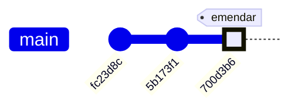
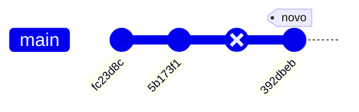
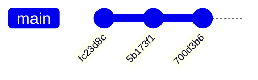
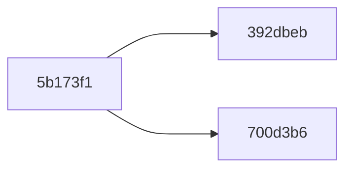
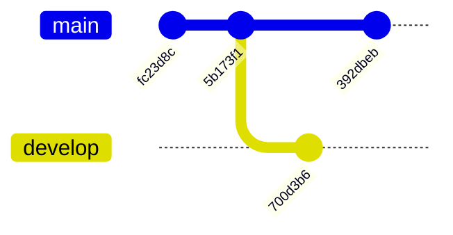

# Dia 6 - Controle de Versionamento (Parte 2/2)

- **Objetivo do Dia:** Entender como trabalhar com o Git online (repositório remoto - origin).

## Resumão: Comandos abordados no dia 6

| Comando | Descrição |
| --- | --- |
| `git push` | Envia as alterações para o repositório remoto. |
| `git pull` (BONUS) | Recebe as alterações do repositório remoto. |

## Local e Origin

Uma analogia simples para entendermos o que é o `local` e o `origin` é pensar no `local` como a **Galeria de Fotos** do seu celular e o `origin` como o **Google Photos** (a nuvem).

### Local (Galeria do Celular)
É o seu computador.
*   Você tira várias fotos (faz `commits`).
*   Você edita, apaga e organiza essas fotos.
*   **Tudo isso acontece só no seu aparelho.** Se o seu celular cair na piscina hoje, você perde tudo. Ninguém na internet consegue ver suas fotos ainda.

### Origin (Google Photos)
É o GitHub (a nuvem).
*   É onde você guarda as fotos para que elas estejam seguras (backup).
*   É onde outras pessoas podem ver suas fotos, caso você dê permissão.
*   **Origin** é apenas o "apelido" padrão que o Git dá para esse lugar na internet de onde você clonou o projeto.

### Sincronizando (Push e Pull)

| Ação | Comando | Analogia |
| :--- | :--- | :--- |
| **Fazer Backup** | `git push` | Você envia as fotos da sua Galeria (Local) para o Google Photos (Origin). Agora elas estão salvas na nuvem. |
| **Restaurar Backup** | `git pull` | Você baixa as fotos do Google Photos (Origin) para a sua Galeria (Local). Útil quando você troca de celular (computador) ou quando outra pessoa adicionou fotos no álbum compartilhado. |

## O "Erro" do Amend

**Local antes do amend**


**Local depois do amend**


**Origin**


Note que a linha do tempo do origin não condiz com a linha do tempo local. Sendo assim, quando tentamos fazer o push do local com amend, no fundo, estamos tentando apontar dois commits diferentes (id's diferentes) para um mesmo commit no origin



Em outras palavras, é como se quisessemos dizer que há duas opções de "futuro" para o commit `5b173f1` ao mesmo tempo. O que é impossível com uma única linha do tempo

> Posteriormente, veremos como podemos ter diversas versões válidas de um código coexistindo no mesmo tempo, usando Branches. Entretanto, com uma única branch (linha do tempo), ter um único nó apontando para mais de um commit é inválido. Por isso, o Git nos dá um erro ao tentar fazer o push.

Por exemplo, podemos ter duas branches `main` e `develop` para tornar este caso válido:



### Como Consertar?

Para consertar basta forçar o repositório origin a aceitar o novo commit, sobreescrevendo a versão atual do origin com a nossa versão local:

```bash
  $ git push -f
  $ git push --force # São a mesma coisa
```

Caso tenha mais de uma Branch no seu repositório, você pode forçar o push para uma branch específica:

```bash
  $ git push -f origin <branch-remota-a-ser-modificada>
```